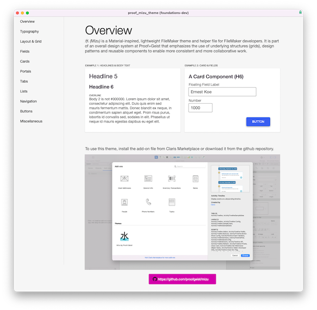

## Mizu

Download the latest release here, https://github.com/proofgeist/mizu/releases

水 (Mizu) is a lightweight, Material and IBM Carbon-inspired theme and helper file for FileMaker developers. It is part of an overall design system at Proof+Geist that emphasizes the use of underlying structures (grids), design patterns and reusable components to enable more consistent and more collaborative work.

Mizu is designed for FileMaker 19 or higher. It works best with FileMaker 19 as an add-on component. It probably works in FileMaker 18 but your mileage may vary :).

For FileMaker 19+ users, you can double click on the `proof_mizu_theme.fmaddon` file. FileMaker will install the add-on and a new custom theme, Mizu by Proof+Geist will appear in your themes menu.

To uninstall Mizu in FileMaker 19, go to Layout Mode and uninstall the add-on from the add-ons panel.

.